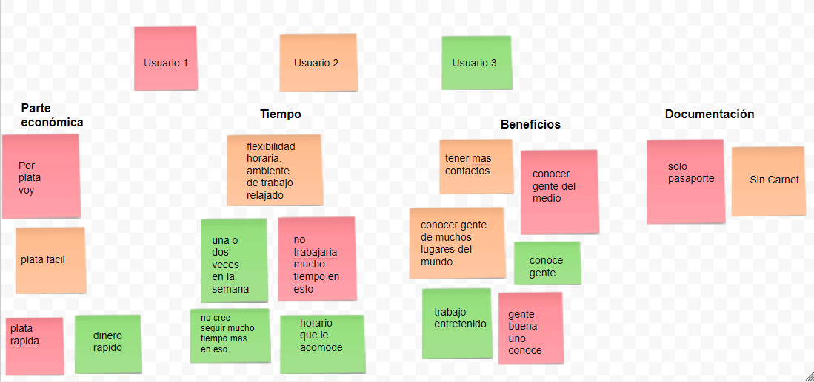

EasyWork
-----------------------------------------------------------------------------------------------------------------

EasyWork es una plataforma de búsqueda de empleo ofreciendo, como valor agregado, todos aquellos trabajos esporádicos en cualquier parte del mundo.

Desarrollado para
-----------------------------------------------------------------------------------------------------------------

Laboratoria

“Mi nombre es Agustina, tengo 29 años y soy Argentina. Vivo en Santiago de Chile hace un año y cinco meses. No se me ha dado fácil, ha sido un proceso de adaptación largo e intenso.
He vivido en un hostal en Providencia los primeros 15 días ni bien llegue al país y recuerdo esa experiencia con nostalgia, eran mis primeros pasos… 
Después, empecé a entender que me había ido de mi casa y que mi vida tomaría otro sentido. 
Claro que ahí fue cuando me percate que el dinero que había ahorrado no era el suficiente para vivir un tiempo en Chile hasta tener mis documentos de visado listos  y poder encontrar algún trabajo.  
Busque empleo, en las plataformas típicas (Laborum y Computrabajo) y realmente no me sirvio ya que no tenía carnet Rut aun y yo simplemente quería un trabajo de momento aunque sea por un dia para ganar algo de plata…

Con la plataforma que ofrecen, de seguro que ayudarán a muchísimas personas que pasen por mi situación!”

Nueva experiencia en búsqueda de trabajo esporádico.

Mi proceso de diseño

DESCUBRIMIENTO E INVESTIGACIÓN
-------------------------------------------------------------------------------------------------------------------

Planeamiento:

Lista de tareas a realizar para avanzar con la investigación.

1- Guia de entrevista
--------------------------------------------------------------------------------------------------------------------

Cómo podemos identificar  las principales necesidades de los usuarios que acuden a trabajos esporádicos,  cuales son sus beneficios y cuáles las motivaciones para realizarlos?

Introducción: 

Buenos dìas, me llamo Agustina estamos acá, para hacer una investigación relacionada con trabajos esporádicos. Te haré algunas preguntas, lo importante es que no te estamos evaluando a ti, sino cómo es tu comportamiento respecto al tema.  Por eso nos ayudas bastante si tus respuestas son lo màs sinceras posibles.  No te cohìbas.  No hay respuestas buenas ni malas.  Queremos que te sientas libre y en confianza para hablar. Si tienes dudas o comentarios que quieras hacer, seràn siempre bien recibidos, y, si por algùn motivo no deseas seguir con la entrevista, puedes avisarme y la dejamos hasta donde quedemos.

¿Empezamos?

Cómo te llamas?  
Que edad tienes?  
De donde eres?  
Qué haces en tu tiempo libre?  
Qué estudios tienes?  
A qué te dedicas?  
Porque buscas trabajos esporádicos e informales?  
Te piden carnet rut, pasaporte o alguna identificación?  
Cómo lo conseguiste?  
Que beneficios te aporta?  
Cuánto tiempo piensas que seguirás realizando este tipo de trabajos?  
Crees que te seria util un sitio donde encontrar todos estos trabajos juntos y poder elegirlos? Porque?  

Debrief (Cierre)  
Te dejo un espacio antes de finalizar la encuesta para que agregues cualquier tipo de comentario que desees…

Muchas gracias por tu ayudarme, haz sido de gran aporte para mi investigación.

Fin.

Documento en Google Drive con las entrevistas realizadas a cada usuario
https://docs.google.com/document/d/1HOKUDZQ1WSeN6PKbUB8bAU3Ol7OWMs_xtK4y-NE1aeU/edit

2- También, realizo los 5 POR QUÉ a un usuario, para ver si puedo profundizar un poco mas...
----------------------------------------

Como haces para conseguir dinero en Chile si no tienes Carnet rut?

Trabajo haciendo pegas, de lo que aparezca. En general trabajo como extra de tv.  
Porque ?  
Por que todos los lugares piden documentos para trabajar.  
Porque?  
Por que asi es el sistema. Si no tienes documentos no te aceptan.  
Porque?  
Por que no pueden hacer las imposiciones que te corresponden.  
Porque?  
Por que si no te imponen tus cotizaciones, los multan.  
Porque?  
Por que es en contra de la ley del trabajo.  

3- Realizo un Benchmark para tomar "comparadores"  de sitios web con el fin de encontrar informacion de utilidad para mi proyecto:
--------------------------

Verlo mas grande: https://docs.google.com/drawings/d/1tr8ol1MrFclYMHrX26gsoC0gkmfYOhR1Odu0keYZ8bI/edit

4- Observacion, proceso muy importante ya que descubro como se comportan los usuarios en varios momentos de trabajo:
--------------------------------

SINTESIS Y DEFINICIÓN
------------------------------------

SINTESIS
----------------------------------------

1.- Affinity Mapping

Durante las horas de clases, comenzé a trabajar en el ejercicio de findings sobre post it para posteriormente realizar el Affinity Mapping donde se agruparon los problemas según su categoría.

2.- Realizo tres User persona para definir tipo de usuarios que comparten una serie de características comunes. Deben recopilar información de: 
-Patrones de conducta de esos usuarios.  	
-Sus objetivos.  
-Sus necesidades.  
-Escenarios donde van a actuar: son descripciones de situaciones de uso para que podamos contextualizar la interacción del usuario con nuestro producto.  

3.- El mapa de empatía nos ayuda a ir más allá de lo que “parece” que quiere nuestro cliente o de lo que dice que quiere para ayudarnos a entender lo que realmente quiere:

4.- Journey Map para conocer los puntos de dolor de mis tres perfiles:

Ideacion:
-----------------------------

Definiendo mi audiencia:
------------------------------------------------------------------------------------------------------------------

Mi audiencia son personas que en algún momento de su vida, pueden pasar por una situación donde tenga que acceder a trabajos esporádicos e informales. Personas de distintas culturas, idiomas, costumbres y diversas edades.

Empezando a pensar en la solucion, y con toda la investigacion realizada, procedo a hacer:

1-Inventario de Contenido
--------------------------

2-Arbol de contenido:
----------------------------

3- Sketch:
------------------------------

4-Wireframes rapidos:
---------------------------

Etapa de Validacion:
-----------------------

Aca es cuando pido a algun usuario que "Naturalmente"  pruebe mi producto para asi ver su comportamiento con el mismo. Aprovechando esa instancia, pido feedback al usuario.

 

